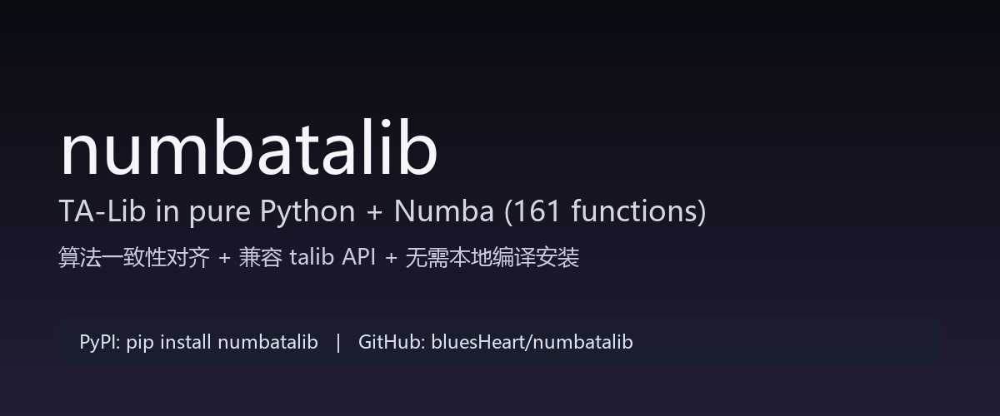
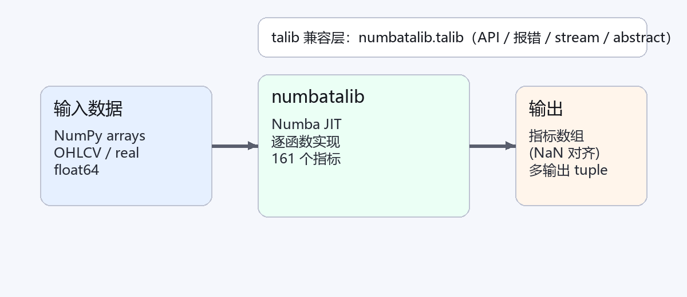

# numbatalib：我把 TA-Lib 用 Numba 重写了（161 个函数、可 pip、还尽量兼容 talib）



如果你在 Windows / conda 上装过 TA-Lib，你大概率懂这种感觉：  
**明明只想算个 `RSI / SMA / MACD`，结果被编译链、依赖、环境变量折腾一下午。**

我自己也踩过坑（尤其是 base 环境里装 `TA-Lib`），所以干脆做了一件“有点轴”的事：  
把 TA-Lib Core 的算法 **全部用 pure Python + Numba 重写一遍**，并且尽量做到：

- 结果对齐（跟 `talib` 输出一致，NaN padding 也对齐）
- 性能别掉（Numba JIT 后接近 C 循环速度）
- 安装像普通包一样简单（不需要本地编译 C 扩展，也不依赖 `libta-lib`）
- 习惯成本低（提供 `talib` 兼容层：API / 报错 / stream / abstract）



---

## 1）一句话先讲清楚：你能用它干什么？

你可以把它当成两种东西：

### A）一个“直接可用”的指标库

```python
import numpy as np
import numbatalib as ta

x = np.random.default_rng(0).normal(size=20000).cumsum()

rsi = ta.RSI(x, timeperiod=14)
macd, signal, hist = ta.MACD(x, fastperiod=12, slowperiod=26, signalperiod=9)
```

### B）一个“尽量像 talib 的替身”

如果你项目里已经写满了 `talib.SMA(...)`，又不想大改代码：先把 import 换一下试跑就行。

```python
import numpy as np
import numbatalib.talib as talib

x = np.random.default_rng(0).normal(size=1000).cumsum()

talib.SMA(x, timeperiod=20)
talib.stream.RSI(x, timeperiod=14)  # streaming: 返回最后一个标量
from numbatalib.talib import abstract
abstract.Function("MACD")(x, fastperiod=12, slowperiod=26, signalperiod=9)
```

---

## 2）安装：像装普通 Python 包一样

```bash
pip install numbatalib
```

不需要你提前装 `libta-lib`，也不用在你的机器上编译 C 扩展。

---

## 3）覆盖度：TA-Lib Core 161 个函数，一个都没落下

- TA-Lib Core：**161 / 161** 已实现
- 你本地装的 `talib==0.4.32`（Python 包）在这个环境里只暴露 158 个函数  
  缺失的 `ACCBANDS / AVGDEV / IMI` 也已经实现，并通过**上游 TA-Lib C** 参考输出做了对齐校验

（你不需要关心这 3 个差异点：只是解释为什么你 `talib.get_functions()` 可能只看到 158。）

---

## 4）你最关心的：结果到底一致不一致？

我不太想用“玄学保证”，所以直接把对齐方式写进了自动化里：

### ① 对比本地 `talib`（158 个函数）

用 `pytest` 做逐函数回归（多种长度 + 多随机种子），浮点输出用：
`np.allclose(..., rtol=1e-10, atol=1e-10, equal_nan=True)`，整数输出要求完全一致。

```bash
pytest -q
```

### ② 对比上游 TA-Lib C（补齐的 3 个函数）

仓库里有脚本会生成上游 C 的参考输出，并写入 CSV：

```bash
python tools/compare_vs_upstream_c.py
```

对齐结果文件：

- `generated/parity_results.csv`
- `generated/parity_results_upstream_c.csv`

---

## 5）速度呢？会不会比 talib 慢很多？

实话说：不同机器/不同 Numba 版本，结果会有差异；但我这边的基准测试里：

- 大部分函数与 `talib` **同量级**（中位数约 1.02x）
- 有些函数会更快（尤其纯数学类）
- 少数函数会慢一些（仍有优化空间）

你可以一键在自己机器上跑一遍（会输出 CSV + 更新 checklist）：

```bash
python tools/compare_vs_talib.py --bench --write-checklist
```

PS：Numba 第一次调用会 JIT 编译，所以 benchmark 记得预热；脚本里已经做了 warmup。

---

## 6）一些“兼容但不打扰”的细节

我做兼容不是为了“看起来像”，而是为了**你迁移时少踩坑**：

- `numbatalib.talib` 尽量复刻 `talib` 的模块结构（`stream` / `abstract`）
- 常见报错信息尽量对齐（例如维度不对、长度不一致、参数类型不对）
- 兼容 `set_compatibility/get_compatibility`、`set_unstable_period/get_unstable_period`（对齐 `EMA/RSI/CMO` 等行为差异）

---

## 7）项目地址 & 下载

- GitHub： https://github.com/bluesHeart/numbatalib
- PyPI： https://pypi.org/project/numbatalib/

如果你用起来遇到“某个函数慢/某个边界条件不一致”，欢迎直接提 issue（最好附一段可复现输入）。

---

## 关注公众号：市场逍遥游

我会把一些“指标实现细节、性能调优、复现笔记”慢慢整理出来发在公众号里。


